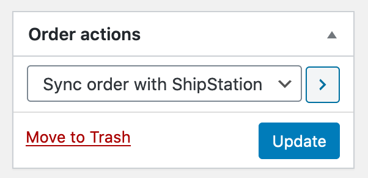
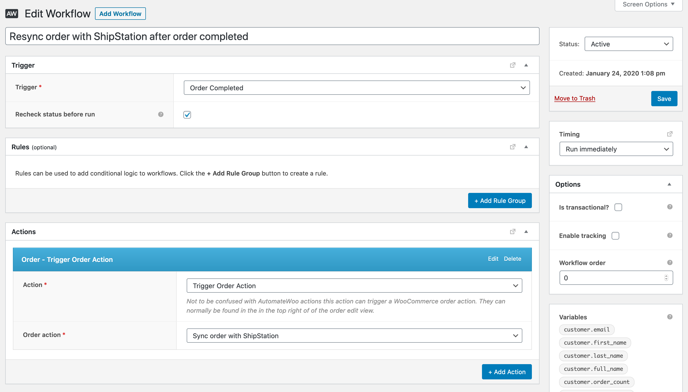
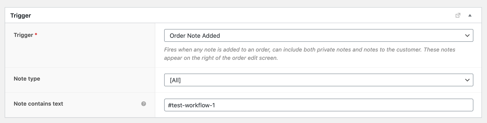
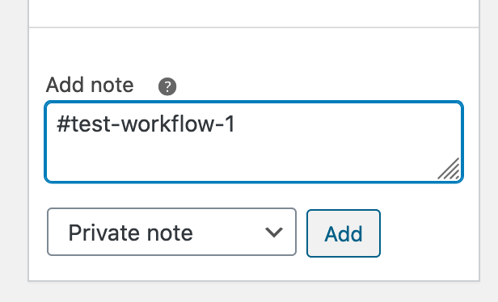
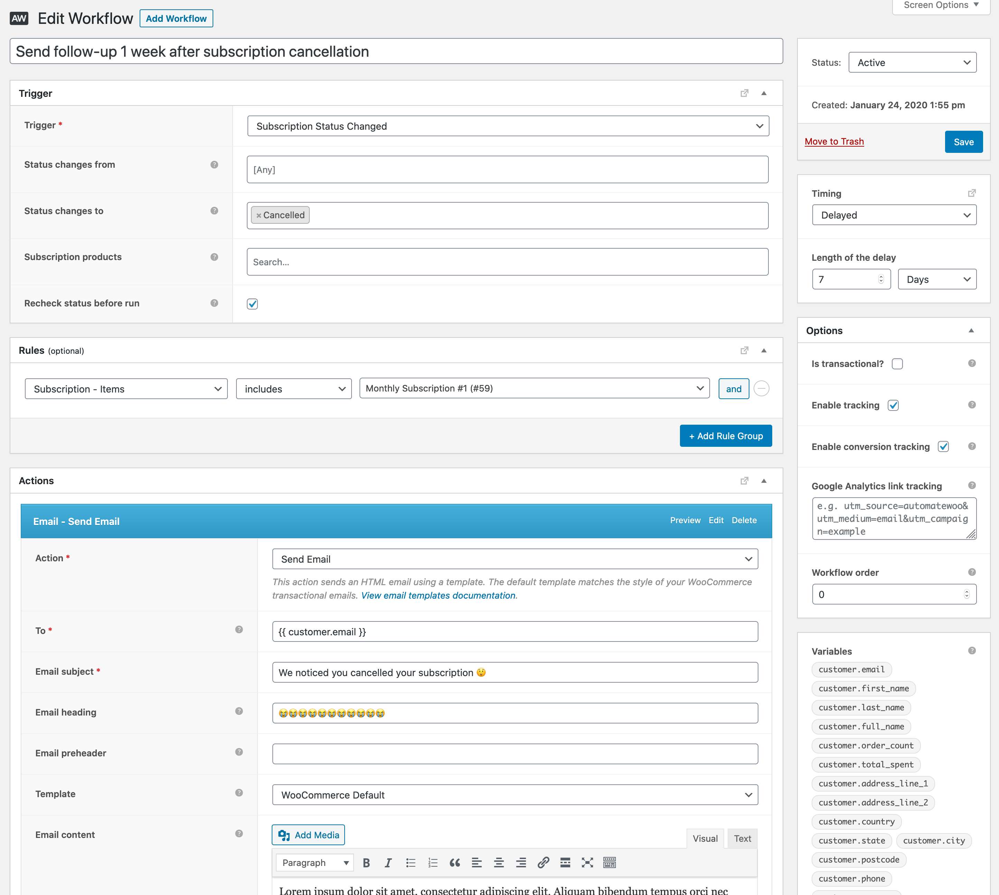

# AutomateWoo - Fatal Error Demo
A plugin to break AutomateWoo for demo purposes.

## Demo #1

This demo creates an WooCommerce order action called **Sync order with ShipStation**. 
It has nothing to do with ShipStation but the aim is to be a believable demo. Sorry ShipStation!  

1. This order action can be triggered successfully by the edit order view.

2. But for some reason, this workflow doesn't work.

3. Lets change the trigger to the **Order Note Added** to test this manually.
  

4. That works ok.

But why doesn't the initial workflow work?

## Demo #2

This example workflow uses the **Subscription Status Changed** trigger to send a follow up email 1 week after cancellation of a subscription. 
It targets a specific product, uses a simple delay and **Send Email** action. Why isn't it working?

## Note
- This plugin doesn't create the above demo workflows. Sorry, this plugin only breaks things.
- When using this demo for training purposes it's probably best not to reveal the plugin name as it spoils the answers. Feel free to rename this plugin after adding it to your site. 
